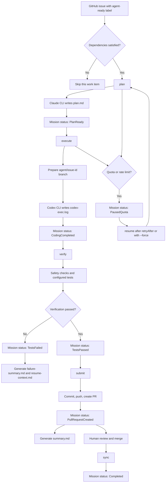

# Agent Foreman

Agent Foreman is a mission control system for AI coding agents.

It coordinates a GitHub issue through planning, implementation, verification, pull request creation, logging, persistent mission state, quota-aware pause/resume, mission events, and run summaries that can later feed RAG memory.

## Current Status

Implemented now:

- CLI orchestration for one ready GitHub issue.
- Claude CLI planning into `plan.md`.
- Codex CLI or opencode CLI execution into `codex-exec.log` / `opencode-exec.log`.
- Configured test execution into `tests.log`.
- Git branch preparation, commit, push, and pull request creation.
- PostgreSQL state store for missions, events, provider state, and run summaries.
- Quota/rate-limit detection with `PausedQuota` state and retry timing.
- Mission resume, cancel, sync, status, event inspection, and summary generation.
- Read-only ASP.NET Core Minimal API for dashboard data.
- Standalone Next.js dashboard frontend for mission monitoring.

Not implemented yet:

- Authentication.
- SignalR/live updates.
- Write actions from the dashboard.
- Embeddings or pgvector.
- Deploy providers.
- RAG retrieval.
- MCP logic.
- Azure DevOps.
- SSP/DSP/OpenRTB systems.

## Repository Layout

```text
src/
  AgentForeman.Api/          ASP.NET Core Minimal API for read-only dashboard data
  AgentForeman.Cli/          CLI entry point and command routing
  AgentForeman.Core/         Core contracts, mission model, provider abstractions
  AgentForeman.Dashboard/    Standalone Next.js dashboard
  AgentForeman.Infrastructure/
                              GitHub CLI, Claude CLI, Codex CLI, Git, PostgreSQL,
                              process execution, orchestration, summaries

tests/
  AgentForeman.Tests/
```

## Configuration

The CLI and API load configuration from `agent-foreman.yaml` by default.

Most commands also accept:

```bash
--config path/to/agent-foreman.yaml
```

For the API, a config path can also be provided through:

```bash
AGENT_FOREMAN_CONFIG=/path/to/agent-foreman.yaml
```

### Executor providers

Set `executor.provider` to pick which coding agent runs the implementation stage:

- `codex-cli` (default): invokes `codex --ask-for-approval <approval> exec --sandbox <sandbox> --cd <repo> "<prompt>"` and writes `codex-exec.log`.
- `opencode-cli`: invokes `opencode run --model <model> --dir <repo> --dangerously-skip-permissions "<prompt>"` and writes `opencode-exec.log`. If `executor.model` is not set, it defaults to `opencode/minimax-m3-free`. The `sandbox` and `approval` fields are codex-only and ignored.

### Planner model

The planner and run-summary generator share the same `planner` provider (Claude CLI by default). The CLI is invoked as `claude --print <prompt>`. To pin the model, set `planner.model` in `agent-foreman.yaml`:

```yaml
planner:
  provider: claude-cli
  command: claude
  model: claude-sonnet-4-6
```

This is also forwarded to `claude --model <model>` for run-summary generation, so all Claude-backed stages use the same model. Use a non-1M-context model (e.g. `claude-sonnet-4-6`) unless the account has usage credits for 1M context enabled.

### Auto-merge (opt-in)

By default Agent Foreman stops after creating the pull request and waits for human review. To let the agent enable GitHub auto-merge on every PR it opens (so each PR is merged automatically as soon as the repo's required checks and approvals are satisfied), set:

```yaml
safety:
  autoMergeAfterChecks: true
  autoMergeMethod: squash   # squash | merge | rebase
```

When enabled, the submit step calls `gh pr merge <num> --auto --<method>` right after `gh pr create`. The mission records an `AutoMergeEnabled` event on success, or `AutoMergeFailed` (warning) if GitHub refuses. Auto-merge is an explicit override of the `Never merge pull requests automatically` safety rule — keep it off unless you trust the agent's `verify` stage to catch every regression.

## CLI

Run help:

```bash
dotnet run --project src/AgentForeman.Cli -- help
```

Common commands:

```bash
dotnet run --project src/AgentForeman.Cli -- doctor
dotnet run --project src/AgentForeman.Cli -- config validate
dotnet run --project src/AgentForeman.Cli -- state status
dotnet run --project src/AgentForeman.Cli -- work-items ready
dotnet run --project src/AgentForeman.Cli -- run-once
dotnet run --project src/AgentForeman.Cli -- daemon --once
dotnet run --project src/AgentForeman.Cli -- status
dotnet run --project src/AgentForeman.Cli -- events github-24
dotnet run --project src/AgentForeman.Cli -- summarize 24
dotnet run --project src/AgentForeman.Cli -- resume github-24 --force
dotnet run --project src/AgentForeman.Cli -- cancel github-24 --reason "reason"
dotnet run --project src/AgentForeman.Cli -- sync --dry-run
```

Stage commands are also available when running the pipeline manually:

```bash
dotnet run --project src/AgentForeman.Cli -- plan 24
dotnet run --project src/AgentForeman.Cli -- execute 24
dotnet run --project src/AgentForeman.Cli -- verify 24
dotnet run --project src/AgentForeman.Cli -- submit 24
```

### Command Reference

`help`, `--help`, `-h`

Prints the CLI help text and exits without loading providers.

`config validate [--config <path>]`

Loads the configuration file and validates required sections. Use this before running missions when changing `agent-foreman.yaml`.

`doctor [--config <path>]`

Checks the config file, configured repository path, git repository status, and required local tools: `git`, `gh`, planner command, and executor command.

`state init [--config <path>]`

Initializes the configured PostgreSQL state schema.

`state status [--config <path>]`

Prints state store metadata such as provider, mission count, and provider-state count.

`exec -- <command> [args...]`

Runs an external process through Agent Foreman's command runner. This is mainly useful for validating process execution behavior in the same environment used by providers.

`git status [--config <path>]`

Inspects the configured `project.repoPath`, prints the current branch, and lists changed files as seen by Agent Foreman.

`git diff [--config <path>]`

Prints the current diff for the configured repository.

`labels list [--config <path>]`

Lists GitHub labels in the configured work-item repository.

`labels sync [--config <path>]`

Creates any missing Agent Foreman lifecycle labels in GitHub and reports whether each label was created or already existed.

`work-items ready [--config <path>]`

Lists GitHub issues that match the ready-work query and shows dependency status when dependencies are declared.

`work-items view <workItemId> [--config <path>]`

Prints a single work item, including title, URL, labels, and body.

`plan <workItemId> [--config <path>]`

Loads the GitHub issue, records a mission in `Planning`, invokes Claude CLI, writes `plan.md`, records mission events, and moves the mission to `PlanReady`. Quota/rate-limit output pauses the mission as `PausedQuota`.

`execute <workItemId> [--config <path>]`

Requires an existing `plan.md`, prepares branch `agent/issue-{id}`, invokes the configured executor (Codex CLI or opencode CLI), writes `codex-exec.log` or `opencode-exec.log`, records events, and moves the mission to `CodingCompleted`. Execution failures and quota pauses generate run summaries when possible.

`verify <workItemId> [--config <path>]`

Runs safety checks and configured test commands in `project.repoPath`, writes `tests.log`, and moves the mission to `TestsPassed` or `TestsFailed`. Failed verification generates failure and resume summaries when possible.

`submit <workItemId> [--config <path>]`

Requires `TestsPassed`, commits current changes on `agent/issue-{id}`, pushes the branch, creates a GitHub pull request, records `PullRequestCreated`, marks the work item for review, and generates a success summary.

`run-once [--config <path>]`

Runs one complete mission for the next ready and unblocked work item: plan, execute, verify, submit, event recording, and summary generation. If no work is ready, it exits successfully with a no-work message.

`daemon [--once] [--interval <seconds>] [--config <path>]`

Polls for ready work items and runs mission ticks. Each tick processes at most one mission or one eligible resume, then waits for the poll interval before checking again. It creates `.agent/agent-foreman.lock` in the configured repo to prevent concurrent daemon instances. `--once` performs one tick and exits.

`status [--all] [--status <MissionStatus>] [--config <path>]`

Shows recent missions from PostgreSQL. By default it prints the latest 20. `--all` removes that limit, and `--status` filters by a mission status such as `PausedQuota`, `Failed`, `PullRequestCreated`, or `Completed`.

`events <missionId> [--limit <number>] [--config <path>]`

Prints structured mission events for one mission, newest repository data first according to the event recorder, with a default limit of 50.

`summarize <missionId|externalWorkItemId> [--config <path>]`

Loads a mission, reads available run artifacts, invokes Claude CLI to create the summary types appropriate for the mission status, writes summary files under `.agent/runs/issue-{id}/`, and saves records in `agent_run_summaries`.

`resume <missionId> [--force] [--config <path>]`

Resumes a paused mission when retry timing allows. `--force` allows retrying failed or not-yet-due paused missions, but it does not bypass repository cleanliness checks.

`cancel <missionId> [--reason <text>] [--config <path>]`

Marks a mission as `Cancelled`, records a cancellation event, and best-effort comments on the GitHub issue. Missions that already created a pull request are not cancelled because review is expected to continue manually.

`sync [--dry-run] [--config <path>]`

Compares local mission state with GitHub issue state. Closed GitHub issues are treated as completion truth: without `--dry-run`, the local mission is marked `Completed` and Agent Foreman review labels are cleaned up.

### Mission Flow



## Mission Artifacts

Mission run files are written under the configured project repository:

```text
.agent/runs/issue-{id}/
  plan.md
  claude-plan.log
  codex-exec.log
  opencode-exec.log
  tests.log
  summary.md
  failure-summary.md
  resume-context.md
  summary-context-successsummary.md
  summary-context-failuresummary.md
  summary-context-resumecontext.md
```

`summary.md` is generated for successful handoff states.

`failure-summary.md` and `resume-context.md` are generated for failed runs.

`resume-context.md` is also generated for quota pauses when useful.

The `summary-context-*` files are intermediate Claude context files kept inside the mission run directory so the summary generator does not pass oversized prompts through CLI arguments.

## API

Run the API:

```bash
dotnet run --project src/AgentForeman.Api -- --config agent-foreman.yaml
```

The development launch profile listens on:

```text
http://localhost:52888
https://localhost:52887
```

Read-only endpoints:

```text
GET /api/health
GET /api/dashboard/summary
GET /api/missions?status=&limit=
GET /api/missions/{id}
GET /api/missions/{id}/events?limit=
GET /api/missions/{id}/summaries
```

Swagger/OpenAPI is enabled in development.

If the API is launched from Visual Studio and cannot find `agent-foreman.yaml`, set `AGENT_FOREMAN_CONFIG` in the launch profile to the absolute config path.

## Dashboard

Run the dashboard:

```bash
cd src/AgentForeman.Dashboard
npm install
npm run dev
```

The dashboard reads from the API by default:

```text
http://localhost:52888
```

Override the API base URL with:

```bash
AGENT_FOREMAN_API_BASE_URL=http://localhost:52888 npm run dev
```

If the API is unavailable, the dashboard falls back to local mock data so the UI still loads.

The dashboard is read-only. It shows:

- Dashboard mission counts.
- Mission table.
- Mission detail metadata.
- Mission event timeline.
- Generated logs and document placeholders.
- Saved run summaries.
- Read-only system status cards.

## Docker Compose

Run the API, dashboard, and PostgreSQL together:

```bash
docker compose up -d --build
```

The Compose setup uses the single project config `agent-foreman.yaml`, with `repoPath` set to `/workspace/elevator-ads-mvp`. It also reuses the existing PostgreSQL data volume from the previous `agent-foreman-postgres` container.

Services are exposed on:

```text
Dashboard: http://localhost:3000
API:       http://localhost:52888
Postgres:  localhost:5432
```

## Development

Build and test .NET projects:

```bash
dotnet test AgentForeman.sln
```

Build the dashboard:

```bash
cd src/AgentForeman.Dashboard
npm run build
```

Run the dashboard adapter test:

```bash
cd src/AgentForeman.Dashboard
node --import tsx --test lib/dashboard-data.test.ts
```

## WSL Repo Policy

If Agent Foreman runs inside WSL, prefer a WSL-native `project.repoPath` such as `~/src/project` instead of `/mnt/c/...`.

When a target repository is on `/mnt/c`, Windows and WSL Git line-ending settings can make the WSL worktree appear dirty even when Windows tooling looks clean. Agent Foreman checks the exact `project.repoPath` from WSL, so branch switching can be blocked by line-ending-only changes.

To reduce that risk, keep target repositories on `LF` and commit a `.gitattributes` policy such as:

```gitattributes
* text=auto
*.cs text eol=lf
*.csproj text eol=lf
*.sln text eol=lf
*.md text eol=lf
*.yml text eol=lf
*.yaml text eol=lf
*.json text eol=lf
*.sh text eol=lf
```

Recommended Git settings inside WSL:

```bash
git config --global core.autocrlf input
git config --global core.eol lf
```

## Troubleshooting

If `resume --force` still fails with a dirty worktree, `--force` only retries a failed or paused mission. It does not bypass repository cleanliness checks. Inspect the exact target repo path:

```bash
git -C /path/from/project.repoPath status --short
git -C /path/from/project.repoPath diff --check
git -C /path/from/project.repoPath ls-files --eol
```

If WSL reports `fork: Resource temporarily unavailable` or `Out of memory`, stop stale Node/Next workers before retrying:

```bash
pkill -f "next"
pkill -f "postcss.js"
pkill -f "node .*jest-worker"
pkill -f "eslint.js"
```

If the system is still resource constrained, run from Windows PowerShell:

```powershell
wsl --shutdown
```

## Scope Guardrails

Keep changes small and tied to the current mission workflow.

Core owns mission concepts and provider abstractions. Infrastructure owns concrete adapters such as GitHub CLI, Claude CLI, Codex CLI, Git, PostgreSQL, and process execution.

Do not commit secrets, modify `.env` files, merge pull requests automatically, or add future systems before their command behavior is being implemented.

## Recovery And Memory

Agent Foreman can use the configured Claude planner to classify failures and execute deterministic recovery actions:

- Dirty worktrees are saved with a named `agent-foreman/recovery-*` Git stash before retrying.
- Transient planning, branch preparation, and coding failures can be retried automatically.
- Failing tests can return to the coding agent for up to `recovery.testRepairAttempts` repair cycles.
- Recovery diagnoses and outcomes are recorded as mission events.
- Reusable lessons are stored in PostgreSQL and injected into future planning and coding prompts.
- Resume context from the previous run summary can be injected when a mission resumes.

Configure the features in YAML:

```yaml
recovery:
  enabled: true
  maxAttempts: 2
  testRepairAttempts: 2
  model: ""

memory:
  enabled: true
  topKLessons: 3
  injectResumeContext: true
```

### RAG Phase 1

The current retrieval implementation uses PostgreSQL full-text search over `agent_lessons`. `ILessonRepository.SearchAsync` hides the retrieval strategy from the orchestrator and prompt builders.

### RAG Phase 2

For hybrid retrieval:

1. Replace the PostgreSQL image with `pgvector/pgvector:pg16`.
2. Add an `embedding vector(1024)` column to `agent_lessons`.
3. Add a configurable embedding provider.
4. Combine FTS rank and cosine similarity inside `ILessonRepository.SearchAsync`.

The orchestrator and prompt callers can continue using the existing interface without changes.
